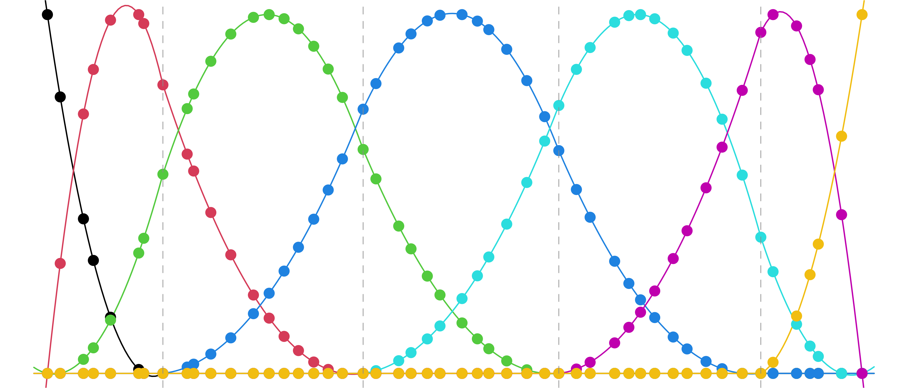

# dspline

These are *not* B-splines:

These are called *discrete* B-splines. They span a function spaced called
**discrete splines**, which are analogous to splines, but defined in terms of 
a suitable discrete notion of smoothness. 

- Discrete splines have continuous *discrete* derivatives at their knots (rather
  than continuous derivatives, as splines do). 

- They have important computational properties, like the fact that interpolation
within the space of discrete splines can be done in *constant-time*. 

- They are intimately connected to trend filtering (they provide the basis
  representation that underlies the trend filtering estimator). 

For more background, see the paper:
  ["Divided Differences, Falling Factorials, and Discrete Splines:
  Another Look at Trend Filtering and Related
  Problems"](https://www.stat.cmu.edu/~ryantibs/papers/dspline.pdf).

The `dspline` package provides tools for computations with discrete splines. The
core routines are written in C++ for efficiency. See the
[reference index](https://ryantibs.github.io/dspline/reference/index.html) for a
summary of the tools that are available.
<!-- and the getting started guide and vignettes a for examples. -->

